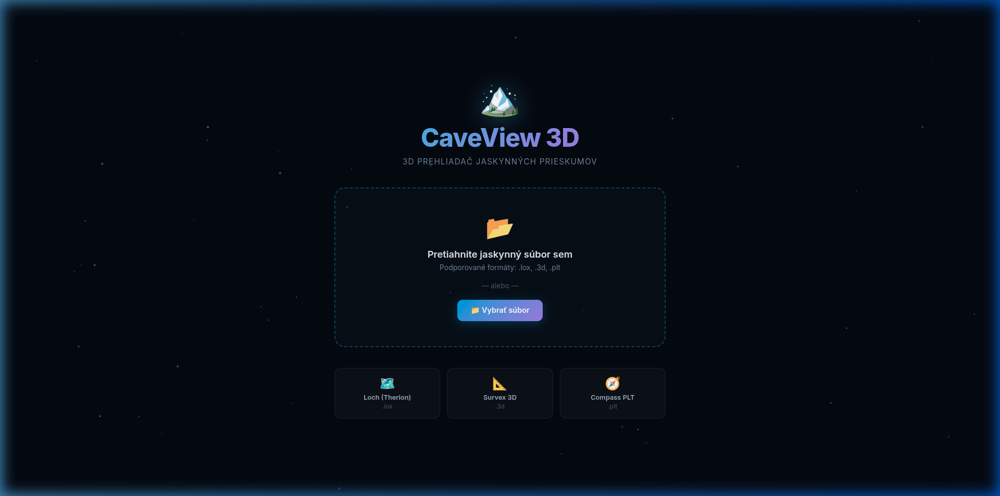
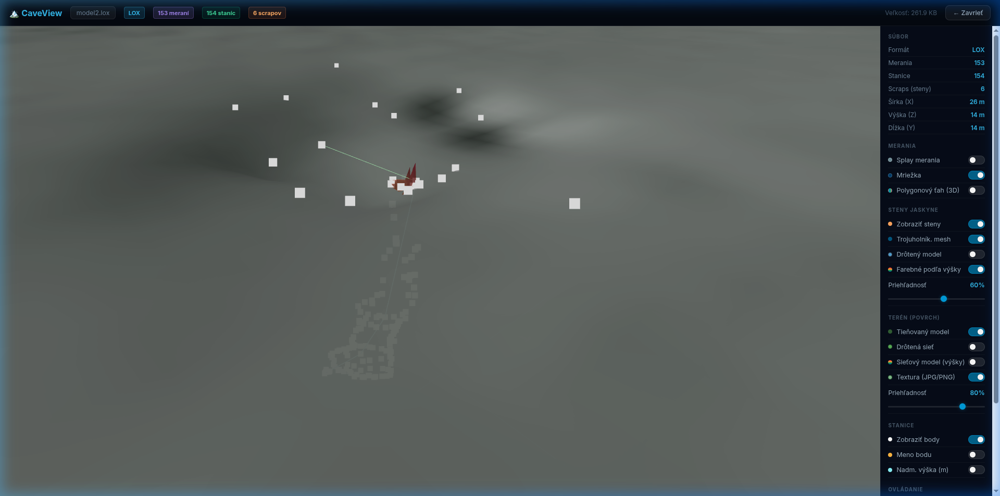
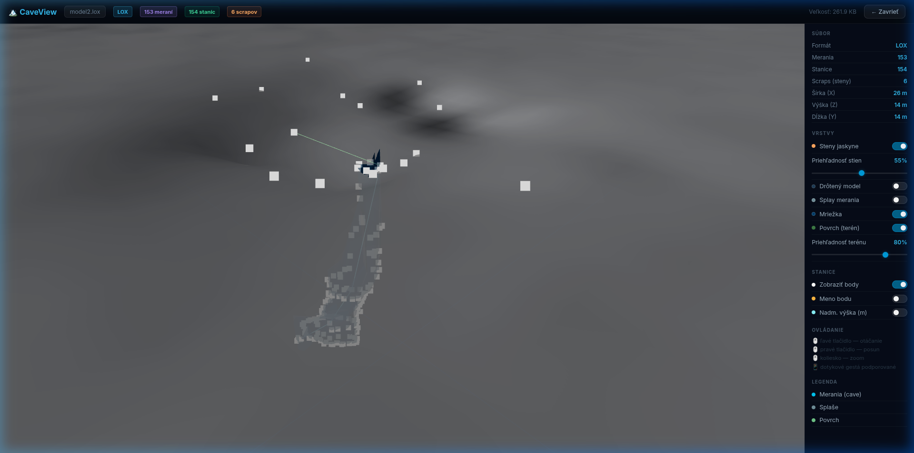
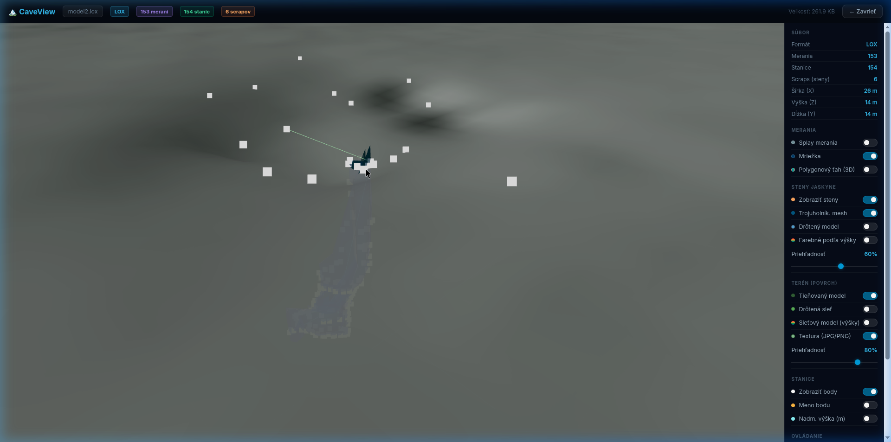

# CaveView 3D

**CaveView 3D** je zmodernizovaný webový prehliadač speleologických dáta a modelov jaskýň priamo v prehliadači. Aplikácia je prepísaná do moderného React ecosystému, využívajúca plnú silu hardvérovej akcelerácie cez Three.js a React-Three-Fiber.



## 🎯 Hlavné Funkcie a Možnosti

Prehliadač obsahuje interaktívny bočný panel, ktorý poskytuje absolútnu kontrolu nad všetkými grafickými vrstvami scény.

### 1. Podporované Formáty Súborov
- **Therion LOX (`.lox`)** – Natívna podpora vrátane ťahov, stien (scraps), povrchov (terén + textúry), a staníc.
- **Survex 3D (`.3d`)** – Merania, Splay, polygonové ťahy, popisy staníc.
- **Compass PLT (`.plt`)** – Základné línie a polygónové trasy v 3D.
- Aplikácia nepracuje s dátami na serveri, všetko sa spracuváva lokálne (Client-Side) v zlomku sekundy.

### 2. Rendering Jaskynných Štruktúr
- **Základný Polygónový Ťah** (Tubes / Lines) – vykreslenie nosnej štruktúry.
- **Merania / Splay** – možnosť vypnúť/zapnúť pomocné slepé zamerania.
- **Trojuholníkový Mesh a "Scraps"** – vizualizácia plných solid stien vypočítaných z nákresov.
- **Drôtený model (Wireframe)** – štruktúrovaná siet obrysov stien nezávisle nastaviteľná a viditeľná cez plné textúry.
  
  

- **Altitude Colormap (Výškové prechody)** – farebné tieňovanie podľa nadmorskej výšky (tzv. "tepelná mapa" výšok) plynulo pre steny aj polygónový ťah.
  
  

### 3. Vizualizácia Terénu (DTM) a Overlay Textúr
Rozsiahla správa vonkajšieho terénu so zachovaním ideálneho depth-sorting (jaskynný model zostáva viditeľný popod vrstvou, terén sa navzájom neprekrýva).
- **Solid Tieňovaný model** terénu.
  
  

- **Drôtená sieť (Terén)** - jemná drôtená mriežka topografického povrchu.
  
  

- **Farebný výškový network model** - povrch je farbený podľa výšky bez textúr.
  
  

- **Ortofotomapa (JPG/PNG textura overlay)** ak je k DTM mriežke priradená mapa.
  
  

### 4. Detailné informácie o stanici a interakcia (Raycasting)
Aplikácia buduje hit-sférický strom. Ak myškou ťukneš na ktorúkoľvek biele bodovú značku (Stanicu), applikácia extrahuje údaje:
- Pôvodné ID/Meno meračského bodu.
- Nadmorskú výšku (m n.m.).
- Zameriavacie "X / Y" voči mriežke (napríklad S-JTSK).
- **Lokácia GPS (WGS84)**: Autokorekcia a prepočet z UTM metrického lokálneho systému automaticky na GPS Latitude/Longitude s možnosťou prekliku priamo do Google Maps.
- **Hĺbka pod Zemou**: Aplikácia dynamicky bilineárne preráta vertikálnu vzdialenosť vybranej stanice k výškovému rastru (DTM) a odpovie aká je hĺbka pre dany bod.



---

## 🛠️ Architektúra Systému a Použité Technológie
Aplikácia beží na čisto modernom stacku:
1. **React 18** – Komponentový a responzívny prístup.
2. **Three.js** & **@react-three/fiber** – Manažment komplexnej 3D Scény (komponentizácia).
3. **@react-three/drei** – Pomocné wrappery (OrbitControls, Html overlay, Wireframe).
4. **Vite** – Rýchly kompilátor a deveserver.
5. **TypeScript** – prísna typová kultúra a detekcia chýb naprieč parsermi a GUI (žiadne voľné `any`).

## 🚀 Inštalácia a Spustenie pre začiatočníkov

Na to, aby si si mohol tento prehliadač spustiť u seba v počítači, nepotrebuješ žiadne zložité serverové nastavenia. Aplikácia beží čisto z lokálnych súborov cez odľahčený testovací webový server.

### Čo potrebuješ stiahnuť (Prerekvizity)
Aplikácia využíva štandardné javascriptové balíčky.
1. Stiahni a nainštaluj si **[Node.js](https://nodejs.org/en/)** (Odporúča sa stiahnuť verziu s označením "LTS" - Long Term Support).
2. To je všetko! Aplikácia npm, ktorá stiahne balíčky, sa nainštaluje spolu s Node.js.

### Prvé spustenie (Krok po kroku)

1. **Stiahni si tento projekt** z GitHubu ako ZIP súbor (a rozbaľ ho) alebo si ho naklonuj cez Git (`git clone`).
2. **Otvor terminál (Príkazový riadok)** vo svojom počítači (Vo Windows: aplikácia "cmd" alebo PowerShell. V MacOS / Linux: aplikácia "Terminal").
3. Vojdi do zložky s projektom. Nahraď cestu za tú tvoju:
   ```bash
   cd cesta/ku/zlozke/CaveView.js
   ```

4. **Nainštaluj závislosti**. Tento príkaz stiahne všetky potrebné knižnice z internetu do zložky `node_modules` (Tento krok robíš len pri úplne prvom spustení):
   ```bash
   npm install
   ```

5. **Spusti lokálny server a prehliadač jaskyne:**
   ```bash
   npm run dev
   ```

6. Terminál ti vypíše lokálnu webovú adresu (obyčajne `http://localhost:5173/`). Skupíruj si tento link a otvor si ho vo svojom obľúbenom internetovom prehliadači (Chrome, Firefox, Safari atď.).
7. Hotovo! Objaví sa uvítacia obrazovka aplikácie, kde môžeš priamo myšou potiahnuť tvoj jaskynný model (napríklad jeden z LOX súborov zo zložky `test_model/`). Zložka s projektom taktiež obsahuje testovacie modely.

## 📦 Ako to zverejniť na webe (Produkčný Build)
Chceš prehliadač zavesiť na svoj vlastný WordPress alebo statický web server? V tom prípade v termináli napíš:

```bash
npm run build
```

Príkaz ti vytvorí zložku s názvom `dist/`. V nej sa nachádzajú hotové čisté HTML, CSS a JS súbory, ktoré stačí akokoľvek myšou nahrať na ľubovoľný hosting / webový FTP priestor. Aplikácia bude fungovať u každého a všade nezávisle na databázach.

