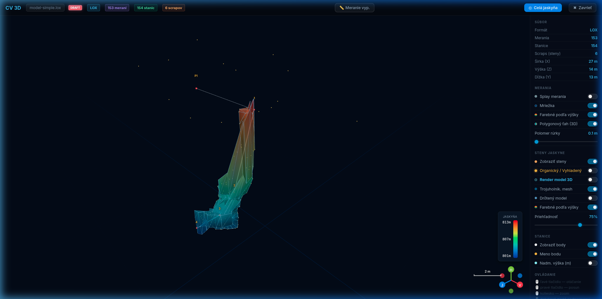
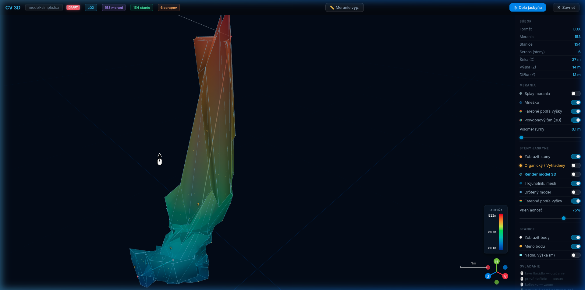

# CaveView 3D (Modernized)

Moderná webová aplikácia na 3D vizualizáciu jaskynných systémov, vybudovaná na technológiách **React**, **Three.js** a **React Three Fiber**. Aplikácia umožňuje speleológom interaktívne skúmať jaskynné dáta, merať vzdialenosti a vizualizovať podzemie v realistickom kontexte.

### 🌐 Live Demo: [loch.sss.sk](https://loch.sss.sk)

## ✨ Kľúčové funkcie

### 🔍 3D Prehliadač a Vizualizácia
- **Realistický Render Mód:** Možnosť aplikovať geologické textúry na steny jaskyne (Vápenec, Granit, Základná skala).
- **Výškové farbenie (Altitude):** Automatický farebný gradient podľa nadmorskej výšky pre steny, polygonové ťahy aj 3D rúrky.
- **Terén a Povrch:** Zobrazenie topografického povrchu s podporou tieňovania, sieťových modelov a satelitných textúr.
- **Splay vizualizácia:** Voliteľné zobrazenie a filtrovanie slepých zamerov (splays).
- **Vizualizácia vchodov:** Interaktívne symboly vchodov a názvy jaskýň v 3D scéne s nezávislým ovládaním viditeľnosti.

### 🛠️ Technické nástroje a Meranie
- **Interaktívne stanice:** Kliknutím na bod získate podrobné informácie: hĺbka pod povrchom, nadmorská výška a presné GPS súradnice (WGS84) prepočítané z UTM.
- **3D Mierka (Jaskyniar):** Možnosť umiestniť do modelu postavičku jaskyniara (stojaci 1.8m / plaziaci sa 0.5m) pre okamžité posúdenie veľkosti priestorov.
- **Dynamická grafická mierka:** Živý Scale-Bar v rohu obrazovky, ktorý sa prispôsobuje úrovni priblíženia (zoomu).
- **Relatívne meranie:** Po výbere dvoch bodov aplikácia vypočíta 3D vzdialenosť, azimut, sklon a prevýšenie medzi nimi.
- **Analýza priestorových rezov (Clipping):**
  - **Vertikálny profil:** Vytvorenie rezu medzi dvoma bodmi s funkciou **Offset (Skenovanie)** pre plynulý posun roviny rezu.
  - **Horizontálny rez:** Dynamické odrezanie horných vrstiev terénu pre pohľad do podzemia.
  - **Precízne ladenie:** Tlačidlá `+` / `-` s krokom **0.5 m** (profil) a **1 m** (výška) pre maximálnu presnosť pri analýze prierezov.

### 📱 Optimalizované UI/UX
- **Mobile-First Design:** Plne responzívne rozhranie s hamburger menu pre smartfóny a tablety.
- **Inteligentné filtre:** Automatické ignorovanie "informačných" názvov bodov (bodka, čiarka, pomlčka) pre čistý vizuálny výstup.
- **Farebné kódovanie:** Jasné rozlíšenie medzi polygonovými bodmi (červené) a splay bodmi (žlté).

## 📂 Podporované formáty
- **Therion (.lox)**
- **Survex (.3d)**
- **Compass (.plt)**

## 🚀 Inštalácia a spustenie

1. Nainštalujte závislosti:
   ```bash
   npm install
   ```
2. Spustite vývojový server:
   ```bash
   npm run dev
   ```
3. Zostavenie produkčnej verzie:
   ```bash
   npm run build
   ```

## 🆕 Release Notes - 21.04.2026-03 (Performance & Stability Audit)

Tento update sa zameriava na technickú dokonalosť, stabilitu pri dlhodobom používaní a výraznú optimalizáciu vykresľovania.

- **Eliminácia únikov pamäte (GPU Optimization):**
  - **Dôsledná správa zdrojov:** Implementované automatické uvoľňovanie pamäte (`dispose()`) pre všetky Three.js geometrie, materiály a textúry. Aplikácia je teraz stabilná aj pri nahrávaní desiatok rôznych súborov po sebe.
  - **Efektívna správa textúr:** Realistické textúry stien a terénu sa teraz po odstránení modelu okamžite uvoľňujú z grafickej karty.
- **Optimalizácia rýchlosti (React Performance):**
  - **Memoizácia hlavného viewera:** Implementovaný `React.memo` pre `CaveViewer3D`, čo zabraňuje zbytočnému prekresľovaniu 3D scény pri zmenách v používateľskom rozhraní (nahrávanie, progres-bar, zmena metadát).
  - **Stabilita komponentov:** Interné komponenty ako `CaveTraverse` a `CaveLegs` boli optimalizované pre rýchlejšiu reakciu na zmeny parametrov.
- **Opravy a Čistota Kódu:**
  - **Lokalizácia:** Doplnená plná podpora prekladu pre všetky interaktívne prvky vrátane tooltipov výberu farieb.
  - **Syntaktická korektnosť:** Opravené typové definície a zabezpečená plná kompatibilita s produkčným buildom.

## 🆕 Release Notes - 21.04.2026-02 (Entrance Visualization & Parser Fixes)

Tento update pridáva kriticky dôležitú vrstvu vizualizácie vchodov a opravuje hĺbkovú logiku parsera pre modely s viacerými jaskynnými systémami.

- **Interaktívna Vizualizácia Vchodov:**
  - **Symboly a Labely:** Automatické generovanie oranžových ikon vchodov a popiskov s názvom jaskyne.
  - **Nezávislé Ovládanie:** Nové prepínače v bočnom paneli umožňujú samostatne vypnúť symboly vchodov alebo ich názvy.
  - **Inteligentné Popisky:** Ak je meno bodu len číslo, aplikácia prioritne zobrazí popis z komentára (napr. "Dvojzavrt" namiesto "1").
  - **Upravená Heuristika:** Detekcia vchodov podľa kľúčových slov (vchod, vstup, entrance, zavrt) aj priamo z Therion flagov.
- **Zásadné Opravy LOX Parsera:**
  - **Oprava Chunk Logiky:** Opravený výpočet veľkosti záznamov (`m_recSize`), čo rieši problémy s načítaním metadát v komplexných súboroch s viacerými záznamami v jednom bloku.
  - **Bitová Detekcia:** Implementovaná podpora pre identifikáciu vchodov pomocou bitových príznakov (`m_flags`), čo zaručuje stabilitu aj pri neštandardných názvoch bodov.
- **UI a Lokalizácia:**
  - Doplnené preklady pre vchody do všetkých jazykov (**SK, EN, FR, DE**).
  - Opravené súradnicové zarovnanie vchodov v 3D scéne (zjednotenie osí X, Z, -Y).

## 🆕 Release Notes - 21.04.2026-01 (Internationalization & UI Polish)

Tento update prináša plnú podporu pre medzinárodné tímy a výrazne vylepšuje stabilitu a vizuálnu čistotu používateľského rozhrania.

- **Plná Internacionalizácia (i18n):**
  - Implementovaná podpora pre 4 jazyky: **Slovenčina (SK)**, **Angličtina (EN)**, **Francúzština (FR)** a **Nemčina (DE)**.
  - **Dynamická detekcia:** Aplikácia automaticky rozpozná jazyk prehliadača pri prvom spustení.
  - **Live Switcher:** Možnosť prepínať jazyky v reálnom čase bez nutnosti znovunačítania stránky.
  - **100% Lokalizácia:** Preložené sú všetky prvky vrátane legendy, pomocníka, analytických nástrojov aj úvodnej obrazovky (Welcome Screen).
- **Vylepšené UI a Ikony:**
  - Integrácia **Material Symbols Outlined** pre moderný a čistý vizuálny štýl ikon.
  - Oprava vykresľovania ikon v tlačidlách (odstránenie textových názvov ikon).
  - Vylepšené rozloženie tlačidiel v hornom paneli (Meranie, Témy, Jazyky).
- **Precízne Analytické Ovládanie:**
  - Optimalizácia kroku tlačidiel `+` / `-` pri vertikálnom profile na **0.5 m** pre detailnú speleologickú analýzu.
  - Obnovenie chýbajúcich ovládacích prvkov pre hrúbku polygónového ťahu a výber farieb mriežky.
- **Technická Stabilita:**
  - Odstránenie redundancií v kóde a oprava JSX štruktúry pre lepšiu kompatibilitu s React 18+.
  - Fix farebných šablón (Themes), ktoré teraz korektne menia pozadie scény a farby vrstiev v reálnom čase.

## 🆕 Release Notes - 20.04.2026-03 (Professional Analytical Clipping)

Tento update transformuje CaveView na plnohodnotný analytický nástroj pre speleologický prieskum pomocou pokročilých priestorových rezov.

- **Pokročilá Analýza Rezov (Clipping Planes):**
  - **Horizontálny rez (Z):** Možnosť "odrezať" kopec nad jaskyňou pre nerušený pohľad do podzemia.
  - **Vertikálny profil (Línia):** Vytvorenie rezu v ľubovoľnej rovine definovanej dvoma bodmi (stanice jaskyne alebo body povrchu).
  - **Scanning Offset (Skenovanie):** Možnosť plynulého posúvania vertikálneho rezu dopredu a dozadu pozdĺž línie. Ideálne na hľadanie optimálneho prierezu chodby alebo sledovanie priebehu chodby pod povrchom.
- **Precízne Ovládanie (Step Controls):** 
  - Všetky analytické posuvníky (výška rezu, offset) sú doplnené o tlačidlá `+` a `-`.
  - Umožňujú **krokové nastavenie s presnosťou 0.1 m**, čo je kľúčové pre presné GIS merania.
- **Plynulý Workflow a Perzistencia:**
  - **Rýchly výber:** Body pre rez je možné vybrať priamo v 3D pohľade pomocou `Ctrl + klik` bez nutnosti zapínať režim merania.
  - **Tlačidlo "Vytvoriť rez":** Integrované priamo v informačnej karte bodu pre okamžitú aktiváciu profilu.
  - **Nezávislosť:** Analytické rezy zostávajú aktívne aj po zatvorení detailu bodu alebo kliknutí na pozadie, až kým ich užívateľ manuálne neresetuje.
- **Konzistentný Render:** Orezávanie sa teraz korektne aplikuje na všetky vrstvy modelu vrátane Drôtenej siete terénu, Sieťového modelu (výšky) a textúrovaného povrchu.

### 🖼️ Ukážka Analýzy (Vertikálny Profil)

*Obr 1: Aktivácia vertikálneho profilu medzi dvoma bodmi s pohľadom na terén.*


*Obr 2: Detailný prierez jaskynnou chodbou s využitím funkcie Offset (posun rezu).*

## 🆕 Release Notes - 20.04.2026-02 (Performance & Adaptive Themes)

Tento update prináša zásadnú architektonickú zmenu zameranú na plynulosť a vizuálnu čistotu pri extrémnych záťažiach.

- **Web Workers (Background Parsing):** Parsovanie veľkých `.lox` súborov bolo presunuté do samostatného vlákna (Worker). Užívateľské rozhranie zostáva plne responzívne aj pri načítavaní 30MB+ modelov.
- **Tiled Terrain (OVR Subdivision):** Terén je teraz rozdelený na dlaždice (tiles) o veľkosti 128x128 bodov. To umožňuje efektívny **Frustum Culling** (GPU spracováva len viditeľné časti) a plynulý pohyb kamerou v rozsiahlych územiach.
- **Adaptive Multi-Theme System:** Implementácia troch nezávislých vizuálnych šablón prepínateľných v reálnom čase:
  - **Precision:** Neutrálna polnočná modrá so zlatými akcentmi (podľa GIS dizajnu).
  - **Classic:** Tradičný čierny mód s prvkami pripomínajúcimi Loch/Aven (biely ťah, zelená mriežka).
  - **Light:** Svetlá téma optimalizovaná pre prácu na priamom slnku.
- **Optimalizácia Priehľadnosti (X-ray View):**
  - Implementovaná prísna hierarchia vykresľovania (`renderOrder`).
  - Inteligentný `depthWrite` pre polopriehľadný terén zabezpečuje, že chodby jaskyne sú vždy jasne viditeľné a korektne vrstvené pod povrchom.
- **Zjednotené UI:** Nový prepínač tém v hornom paneli s okamžitou odozvou.

## 🛠️ TODO / Plán optimalizácie
*Aktuálny stav:*

- [x] **GPU Akcelerácia:** Presun výpočtu výškového farbenia do shaderov a optimalizácia renderovania.
- [x] **Instanced Rendering:** Tisíce staníc sú vykresľované pomocou `InstancedMesh`.
- [x] **LOD Systém:** Implementácia Level of Detail pre rozsiahle modely terénu a stien.
- [x] **Stable Scale Bar:** Dynamická grafická mierka v UI vrstve.
- [x] **Dynamic Colors:** Plná podpora pre užívateľský výber farieb pre všetky vrstvy.
- [x] **BVH Integrácia:** `three-mesh-bvh` pre extrémne rýchly raycasting.
- [x] **Asynchrónne spracovanie:** Vizualizácia stavu generovania modelu a BVH.
- [x] **Web Workers:** Parsovanie .LOX na pozadí (zero UI-freeze).
- [x] **Tiled Rendering:** Rozdelenie terénu na dlaždice pre lepší Frustum Culling.
- [x] **Full i18n:** Podpora viacerých jazykov (SK, EN, FR, DE).
- [x] **Precise UI Controls:** Tlačidlá +/- pre analytické nástroje.
- [ ] **Dátová kompresia:** Optimalizácia prenosu dát medzi parserom a GPU.

---
*Vyvinuté pre Slovak Speleological Society (SSS) v roku 2026.*
